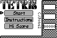

# Greyscale Tetris
An awesome game of Tetris for the TI-83 and TI-84 calculators that I wrote in 2008. 🙂

For more info about uploading the game to your calculator, see https://www.ticalc.org/archives/files/fileinfo/429/42979.html.

The source code is written in [z80 assembly language](https://tutorials.eeems.ca/ASMin28Days/lesson/toc.html).

## Screenshot

## Keys
* up - rotate piece
* down - moves one down
* left - moves left
* right -right
* clear- exit
* 2nd - all menus, also forces piece down
* mode - pause\ un pause
* On - teacher key, quick  exit

## Timeline
### October 2, 2010
* More levels
* Key sensitivity reworked for rotate button for more precision
* keys more sensitive
* when pieces are about to lock, you can slide and rotate them for a few seconds
* can rotate at top of grid

### August 11, 2008
* Teacher key added, changed the key layout a bit from the weird "GRAPH" for exiting, now clear

## License
MIT
